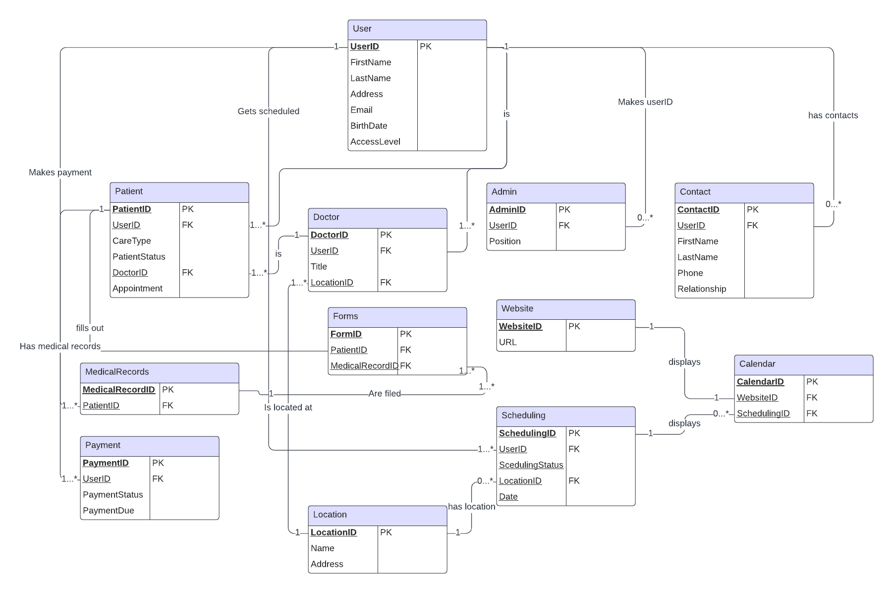
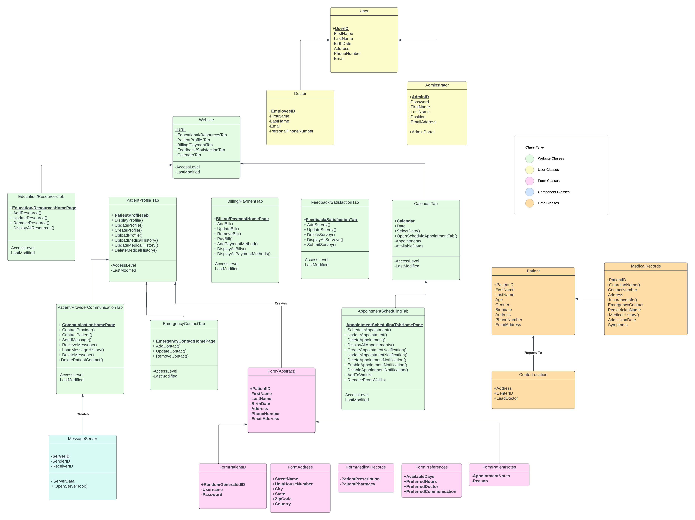
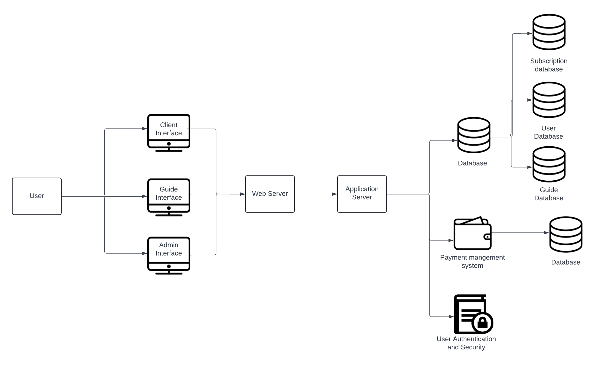

# Therapy Scheduler - System Design

## Overview
This project models a therapy company's scheduling system, covering database structure, class interactions, and overall system architecture.

## Artifacts

### 1. Entity-Relationship Diagram (ERD)
Models the database structure: patients, doctors, and appointments.

### 2. Class Diagram
Models object-oriented relationships between entities.

### 3. System Architecture Diagram
Shows system layers: client, server, and database.

## Tools Used
- Lucidchart
- UML Standards

## Learning Outcomes
- System analysis and design
- Relational database modeling
- Object-oriented design
- Software architecture modeling
